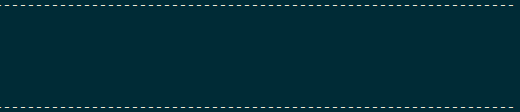

<br>
<br>

# BigAsciiChars

BigAsciiChars is a module that displays a given string as if it were on a grid of large pixels.

## Installing

_Pending submission to the PowerShell Gallery_

```powershell
Install-Module -Name BigAsciiChars -Scope CurrentUser
```

## Examples

### Write text using the default 5x5 font

```powershell
Write-BigText -Text 'This module is so cool!'
```

<br>

### Go even bigger with the 8x8 font
```powershell
$8x8Font = New-BAFont -Name Simple8x8
Write-BigText -Text 'OMG Huge' -Font $8x8Font
```
<br>

### Create a scrolling display with your custom message and choice of font
```powershell
Write-ScrollText -Text $MyMessage
```
<br>

## How it works
Characters are stored as Int64 values with each bit representing an _off or on_ for the display. The bits are stored left to right, top to bottom going from Most Significant bit (MSB) to Least Significant Bit (LSB).
The module makes heavy use of bitwise operators to rebuild the display characters quickly and efficiently


## Contributing

### Design a new font!
We could do with some more custom fonts! Inside the repo is an Excel spreadsheet helful for quickly generating the required Int64 values for your design. You can then copy and paste the values into a new class in the module, ready to share.

<br>

Your new font class should follow the pattern of the other fonts in the module, and be sure to inherit from FontBase.
Important: if your character does not fill the entire width, it should be shifted to the right of the design box. Blank space to the left is trimmed, but not the right.

## Notes

This should very much be considered a beta release. I've no idea why you'd use this in a production environment, but if you do, be aware that functions may be renamed or deleted without breaking change notifications.

## Authors

* **David Johnson** - [Cirzen](https://github.com/Cirzen)  / [@12ToneTech](https://www.twitter.com/12ToneTech)

## License

This project is licensed under the GNU General Public License - see the [LICENSE](LICENSE) file for details.

## Acknowledgments

* DefaultFont designed by David Johnson and Josh 'Windos' King
* Simple8x8 font designed by David Johnson
